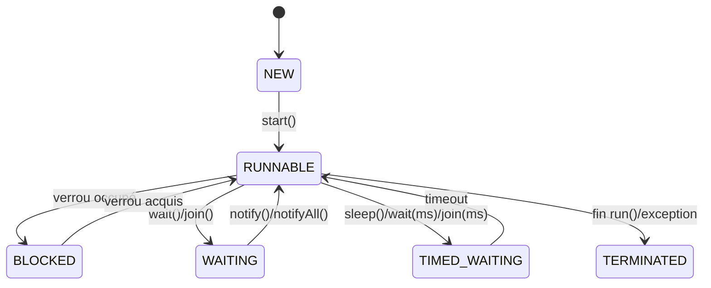

+++
draft = false
title = 'Treads en Java'
weight = 71
+++


## 1) De la machine au programme : processeur, multitâche, multithread

### 1.1 Processeur, mono-cœur vs multi-cœurs

* **Monoprocesseur (mono-cœur)** : à un **instant donné**, un seul programme tourne sur l’unité centrale. L’**illusion de simultanéité** vient du système d’exploitation (OS) qui **passe la main** très vite d’un programme à l’autre (préemption + quantum de temps).
* **Multiprocesseur / multicœur** : une même puce contient **plusieurs cœurs** indépendants. On peut exécuter **plusieurs threads réellement en parallèle** (un par cœur), ce qu’on appelle **TLP – Thread Level Parallelism**.

### 1.2 Multitâche (au niveau OS)

* Le **multitâche** désigne la capacité de l’OS à exécuter (ou donner l’illusion d’exécuter) **plusieurs processus** “en même temps” en **partageant le CPU**.
* Sur I/O (clavier, disque, réseau…), l’OS **profite des attentes** d’un programme pour **planifier** un autre.

### 1.3 Multithreading (à l’intérieur d’un processus)

* Le **multithread** étend le multitâche **à l’échelle d’une application** : un **processus** peut contenir **plusieurs threads**, chacun étant un **flux d’exécution**.
* Sur **multi-cœurs**, des threads peuvent **avancer vraiment en parallèle** (TLP). Sur **mono-cœur**, on retrouve l’**illusion** via le **time-slicing** de l’OS/JVM.

## 2) Threads, sections critiques, exclusion mutuelle

### 2.1 Définitions essentielles

* **Objet critique** : ressource **non réentrante**/non simultanément accessible (imprimante, fichier, structure mémoire…).
* **Section critique** : code qui **manipule** un objet critique. Sans protection, l’exécution concurrente peut produire des **résultats imprévisibles**.
* **Exclusion mutuelle** : garantir qu’**au plus un thread** exécute **la section critique** à un instant donné.

### 2.2 Problèmes classiques

* **Condition de course (race)** : deux threads lisent/modifient un état partagé **sans coordination** → incohérences.
* **Interblocage (deadlock)** : t1 tient le verrou A et attend B, t2 tient B et attend A → **attente circulaire** infinie.
* **Famine (starvation)** / **livelock** : un thread n’obtient jamais les ressources / tout le monde bouge mais **rien n’avance**.

## 3) Le modèle mémoire Java (JMM) en pratique

* **Visibilité** : quand une écriture par t1 devient visible par t2 ?
* **Atomicité** : une opération se fait-elle “d’un seul coup” ?
* Outils :

  * `volatile` ⇒ **visibilité garantie** (pas d’atomicité).
  * `synchronized` / **verrous** (`ReentrantLock`) ⇒ exclusion + **publication** (visibilité).
  * **Types atomiques** (`AtomicInteger`, `LongAdder`) ⇒ **opérations atomiques** sans verrou explicite.

## 4) Les threads en Java : API, cycle de vie, priorités

### 4.1 Créer un thread

Deux approches idiomatiques :

```java
// 1) Runnable
class Tache implements Runnable {
  @Override public void run() { /* travail */ }
}
Thread t = new Thread(new Tache(), "T1");
t.start();

// 2) Étendre Thread 
class Worker extends Thread {
  public Worker(String name) { super(name); }
  @Override public void run() { /* travail */ }
}
new Worker("W1").start();
```

> **Important** : on **n’appelle jamais** `run()` directement pour démarrer un thread — on appelle **`start()`** qui confie l’exécution à la JVM/OS. `start()` **ne peut être appelé qu’une fois** par instance, sinon `IllegalThreadStateException`.

### 4.2 Méthodes essentielles de `Thread`

* `start()` : demande à la JVM d’exécuter `run()` dans un **nouveau** thread.
* `sleep(ms[, ns])` *(statique)* : endort **le thread courant**.
* `interrupt()` / `isInterrupted()` / `interrupted()` : **signal d’arrêt** non violent (coopératif).
* `join()` / `join(timeout)` : **attendre la fin** d’un autre thread.
* `setPriority(1..10)` : **à éviter** en pratique (portabilité/équité non garanties).
* `yield()` : propose de laisser la main (effet non garanti → diagnostique/démo).

> Méthodes historiques comme `stop()`, `suspend()`, `resume()`, `destroy()` sont **dangereuses/déconseillées** (incohérences d’état). On privilégie **l’interruption** et un **arrêt gracieux**.

### 4.3 Cycle de vie (états)



* **Prêt (RUNNABLE)** : éligible CPU. L’OS/Horaireur choisit **qui** tourne.
* **Bloqué/Attente** : sommeil, I/O, attente de verrou ou de signal (wait/notify).
* **Terminé** : `run()` a fini ou a levé une exception non rattrapée.

## 5) Synchronisation et coordination

### 5.1 `synchronized` : verrou intrinsèque (moniteur)

```java
class Compteur {
  private int v = 0;
  public synchronized void inc() { v++; }
  public synchronized int get() { return v; }
}
```

* Variante **bloc** (pour réduire la zone critique) :

```java
synchronized (verrou) {
  // section critique
}
```

* **Rappel** : le verrou est lié à **l’objet** (ou à la `Class` pour static).

### 5.2 `wait/notify/notifyAll` : coordination bas-niveau

* À n’utiliser **que dans** un bloc/méthode `synchronized` **sur le même objet**.
* `wait()` libère le verrou et met le thread en attente.
* `notifyAll()` réveille **tous** les threads en attente (préféré à `notify()`).

Exemple (file 1-élément) :

```java
class Boite {
  private Integer item = null;
  public synchronized void produire(int x) throws InterruptedException {
    while (item != null) wait();
    item = x;
    notifyAll();
  }
  public synchronized int consommer() throws InterruptedException {
    while (item == null) wait();
    int x = item; item = null;
    notifyAll();
    return x;
  }
}
```

### 5.3 Alternatives modernes (recommandé)

* **Collections concurrentes** : `ConcurrentHashMap`, `CopyOnWriteArrayList`.
* **Queues bloquantes** : `BlockingQueue` (`Array/LinkedBlockingQueue`, `SynchronousQueue`) pour **producteur/consommateur**.
* **Synchronisateurs** : `CountDownLatch`, `CyclicBarrier`, `Phaser`, `Semaphore`.

#### Producteurs/Consommateurs avec `BlockingQueue`

```java
import java.util.concurrent.*;

public class PC {
  public static void main(String[] args) throws Exception {
    BlockingQueue<String> q = new ArrayBlockingQueue<>(100);
    ExecutorService pool = Executors.newFixedThreadPool(3);
    var prod = pool.submit(() -> { for (int i=0;i<1_000;i++) q.put("msg-"+i); return null; });
    var cons1 = pool.submit(() -> { while (!Thread.currentThread().isInterrupted()) System.out.println(q.take()); });
    var cons2 = pool.submit(() -> { while (!Thread.currentThread().isInterrupted()) System.out.println(q.take()); });

    prod.get(); pool.shutdownNow(); pool.awaitTermination(2, TimeUnit.SECONDS);
  }
}
```

#### Sémaphore (`java.util.concurrent.Semaphore`)

* **Contrôle d’accès** à N ressources identiques.

```java
import java.util.concurrent.Semaphore;

class PoolRessources {
  private final Semaphore sem = new Semaphore(3); // 3 accès simultanés
  void utiliser() throws InterruptedException {
    sem.acquire();
    try { /* section utilisant la ressource */ }
    finally { sem.release(); }
  }
}
```

* `tryAcquire()` pour éviter les blocages, `acquireUninterruptibly()` pour ignorer l’interruption (rarement conseillé).

### 5.4 Verrous explicites (`ReentrantLock`)

* Avantages : `tryLock()`, **plusieurs conditions** (`newCondition()`), diagnostic équitable.

```java
import java.util.concurrent.locks.*;

class CompteurLock {
  private int v = 0;
  private final ReentrantLock lock = new ReentrantLock();
  int incEtGet() {
    lock.lock();
    try { return ++v; }
    finally { lock.unlock(); }
  }
}
```

## 6) Exécution asynchrone : pools, futures, composition

### 6.1 `ExecutorService` : déléguer l’exécution à un **pool**

```java
import java.util.concurrent.*;

public class DemoExecutor {
  public static void main(String[] args) throws Exception {
    ExecutorService pool = Executors.newFixedThreadPool(Runtime.getRuntime().availableProcessors());
    try {
      Future<Long> f = pool.submit(() -> {
        long s=0; for (int i=0;i<5_000_000;i++) s += i; return s;
      });
      System.out.println("Somme = " + f.get()); // bloquant
    } finally {
      pool.shutdown(); pool.awaitTermination(5, TimeUnit.SECONDS);
    }
  }
}
```

* **Tailles de pool** : proche du nombre de cœurs pour tâches **CPU-bound**; `newCachedThreadPool()` pour **I/O-bound**.

### 6.2 `CompletableFuture` : pipelines non bloquants

```java
import java.util.concurrent.*;

public class DemoCF {
  public static void main(String[] args) {
    CompletableFuture.supplyAsync(() -> 21)
      .thenApply(x -> x * 2)                 // 42
      .thenCombine(CompletableFuture.supplyAsync(() -> 1), Integer::sum) // 43
      .orTimeout(500, TimeUnit.MILLISECONDS)
      .exceptionally(ex -> -1)
      .thenAccept(System.out::println)
      .join(); // attendre la fin sans try/catch
  }
}
```

* Opérateurs : `thenApply/Compose`, `thenCombine`, `allOf/anyOf`, `handle`, `exceptionally`, `orTimeout/completeOnTimeout`.

## 7) Interruption et arrêt **gracieux**

### 7.1 Patron d’interruption

```java
class TacheLongue implements Runnable {
  @Override public void run() {
    while (!Thread.currentThread().isInterrupted()) {
      try {
        // travail…
        Thread.sleep(100);
      } catch (InterruptedException e) {
        Thread.currentThread().interrupt(); // rétablir le flag et sortir
      }
    }
  }
}
```

### 7.2 Arrêter un pool proprement

```java
pool.shutdown();                       // plus de nouvelles tâches
if (!pool.awaitTermination(5, SECONDS)) {
  pool.shutdownNow();                  // interrompre les tâches en cours
}
```

## 8) Deadlocks : comprendre, reproduire, corriger

### 8.1 Exemple de deadlock

```java
public class Deadlock {
  static final Object A = new Object();
  static final Object B = new Object();

  public static void main(String[] args) throws Exception {
    Thread t1 = new Thread(() -> {
      synchronized (A) {
        dormir(100);
        synchronized (B) { /* ... */ }
      }
    }, "T1");

    Thread t2 = new Thread(() -> {
      synchronized (B) {
        dormir(100);
        synchronized (A) { /* ... */ }
      }
    }, "T2");

    t1.start(); t2.start();
    t1.join(); t2.join();
  }

  static void dormir(long ms) { try { Thread.sleep(ms); } catch (InterruptedException ignored) {} }
}
```

→ t1 **garde A** et attend B, t2 **garde B** et attend A : **boucle d’attente**.

### 8.2 Stratégies d’évitement

* **Ordonnancement global** des verrous : **toujours les acquérir dans le même ordre**.

```java
void travail(Object first, Object second) {
  Object a = first.hashCode() < second.hashCode() ? first : second;
  Object b = (a == first) ? second : first;
  synchronized (a) { synchronized (b) { /* section critique */ } }
}
```

* `tryLock(timeout)` + **backoff** (avec `ReentrantLock`).
* **Réduire la granularité** et la **durée** des sections critiques.

## 9) Bonnes pratiques (robustesse, performance, portabilité)

* **Immuabilité d’abord** : partager des objets immuables évite des verrous.
* **Confinement de thread** : chaque thread possède son état (ou `ThreadLocal`).
* **Toujours limiter la section critique** au strict nécessaire.
* **Éviter `wait/notify` bruts** si une **`BlockingQueue`** ou un synchronisateur convient.
* **Timeouts partout** : `get(timeout)`, `orTimeout`, `tryLock(timeout)`.
* **Journalisation** et métriques (débit, latences, longueurs de files).
* **Ne pas compter sur les priorités** de threads pour la logique métier.
* **Tester sous charge** (courses, contention, interblocages).
* **Séparer CPU-bound / I/O-bound** en pools dédiés (évite la famine).

## 10) Exemples rapides “prêts à exécuter”

### 10.1 Mesurer une course (race) puis corriger

```java
// Non thread-safe
class Counter { int v=0; void inc(){ v++; } }
public class Race {
  public static void main(String[] a) throws Exception {
    var c = new Counter();
    var t1 = new Thread(() -> { for(int i=0;i<1_000_000;i++) c.inc(); });
    var t2 = new Thread(() -> { for(int i=0;i<1_000_000;i++) c.inc(); });
    t1.start(); t2.start(); t1.join(); t2.join();
    System.out.println("Attendu=2000000, Obtenu="+c.v);
  }
}
```

```java
// Correction atomique
import java.util.concurrent.atomic.AtomicInteger;
public class Atomic {
  public static void main(String[] a) throws Exception {
    var v = new AtomicInteger();
    var t1 = new Thread(() -> { for(int i=0;i<1_000_000;i++) v.incrementAndGet(); });
    var t2 = new Thread(() -> { for(int i=0;i<1_000_000;i++) v.incrementAndGet(); });
    t1.start(); t2.start(); t1.join(); t2.join();
    System.out.println("Résultat="+v.get());
  }
}
```

### 10.2 `invokeAny` / `invokeAll` (meilleur et tous les résultats)

```java
import java.util.*;
import java.util.concurrent.*;

public class Invoke {
  public static void main(String[] args) throws Exception {
    ExecutorService pool = Executors.newFixedThreadPool(4);
    try {
      List<Callable<String>> taches = List.of(
        () -> { Thread.sleep(300); return "A"; },
        () -> { Thread.sleep(100); return "B"; },
        () -> { Thread.sleep(200); return "C"; }
      );
      String fastest = pool.invokeAny(taches); // le plus rapide
      System.out.println("Plus rapide = " + fastest);
      for (Future<String> f : pool.invokeAll(taches)) System.out.println(f.get());
    } finally { pool.shutdown(); }
  }
}
```

### 10.3 Sémaphore pour limiter l’accès concurrent à une ressource

```java
import java.util.concurrent.Semaphore;
public class Limiteur {
  static final Semaphore SEM = new Semaphore(2); // 2 en parallèle
  static void tache(String nom) {
    try {
      if (SEM.tryAcquire()) {
        System.out.println(nom+" entre");
        Thread.sleep(200);
      } else {
        System.out.println(nom+" refuse (limite atteinte)");
      }
    } catch (InterruptedException e) { Thread.currentThread().interrupt(); }
    finally { if (SEM.availablePermits()<2) SEM.release(); }
  }
  public static void main(String[] args) {
    for (int i=0;i<5;i++) new Thread(() -> tache(Thread.currentThread().getName())).start();
  }
}
```

## 11) Résumé

* **Concevoir** le parallélisme : CPU-bound ≠ I/O-bound, **taillez** vos pools.
* **Protéger** l’état partagé : immuabilité → atomiques → `synchronized`/locks.
* **Coordonner** avec `BlockingQueue`, `CountDownLatch`, `Semaphore`, plutôt que `wait/notify` brut.
* **Gérer l’arrêt** : `interrupt` + `shutdown`/`awaitTermination`.
* **Éviter les deadlocks** : ordre de verrous, `tryLock(timeout)`, petites sections.
* **Observer** : logs, métriques, profils de contention, noms de threads (`ThreadFactory`).
* **Tester** sous charge et avec timeouts.

